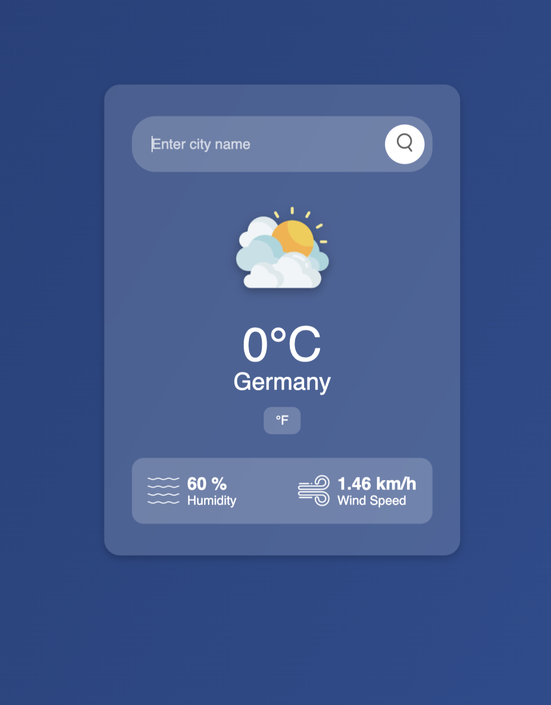

# 🌦️ Weather App

A simple yet stylish weather app built with **HTML, CSS, and JavaScript** that fetches real-time weather data using the **OpenWeather API**. This project helped me understand **API integration, DOM manipulation, and event handling** while improving my frontend skills.

## 🚀 My Experience  
As a **beginner**, this project was a great learning experience! I started with the basics of fetching data from an API, styling with CSS, and handling user input. Along the way, I added features like:  
✅ **Temperature unit toggle** (Celsius ↔️ Fahrenheit)  
✅ **"Enter" key support** for a better user experience  
✅ **Error handling** for invalid city names  
✅ **A clean and responsive UI**  

## 🎨 Features  
- 🌍 **Search any city** to get real-time weather updates  
- 🌡️ **Toggle between Celsius (°C) and Fahrenheit (°F)**  
- ⌨️ **Press "Enter" to search** without clicking the button  
- 🎨 **Modern and responsive design**  

## 🛠️ Technologies Used  
- **HTML** – Structure  
- **CSS** – Styling & UI  
- **JavaScript** – Functionality & API handling  
- **OpenWeather API** – Real-time weather data  

## 📸 Preview  
  

## 🔧 Setup Instructions  
1️⃣ Clone this repository:  
```bash
git clone https://github.com/BORED-ARADHYA/weather-app.git
